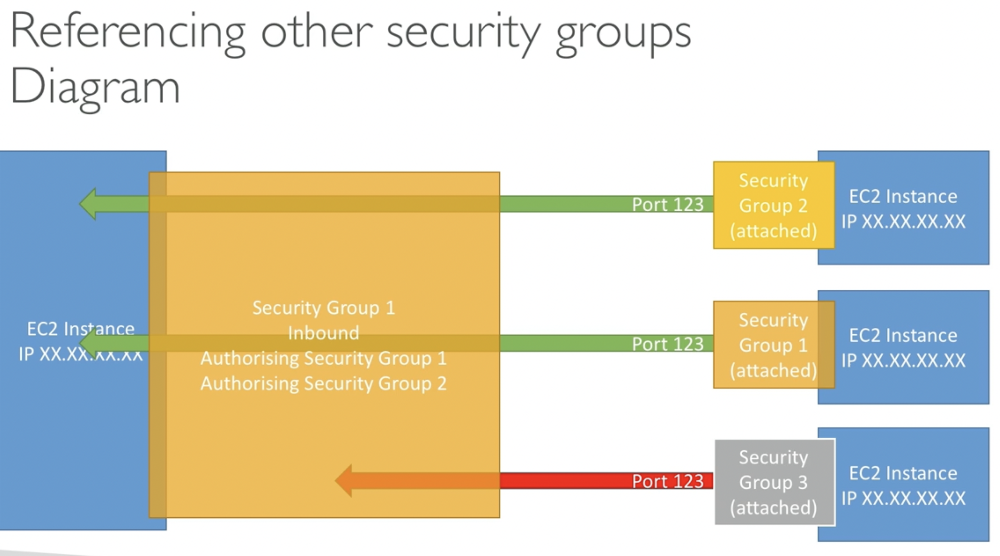

# AWS EC2 - Elastic Compute Cloud (IaaS)

## Basically consists in:
- Renting virtual machines (AWS EC2 - Elastic Compute Cloud)
- Storing data in virtual drives (AWS EBS - Elastic Block Store)
- Distributing load across machines (AWS ELB - Elastic Load Balancing)
- Scaling the services using an auto-scaling group (ASG - Auto Scaling Group)

## EC2 sizing and configuration options
- Operating system (OS): linux, windows or macos
- How much compute power & cores (CPU)
- How much random-access memory (RAM)
- How much storage space:
  - Network attached (EBS & EFS)
  - hardware (EC2 instance Store)
- Network card: speed of the card, Public IP address.
- Firewall rules: security group.
- Bootstrap script (configure at first launch): **EC2 User Data**.
  - **EC2 User Data**: provides you an option to run commands when a machine starts.
  - It is used to automate boot tasks like installing dependencies and etc...
  - It runs with the root user, **sudo** on linux.

## [EC2 Instance Types](https://aws.amazon.com/ec2/instance-types/)

- ## AWS Naming convention example:
  - m5.2xlarge
    - m: instance class
    - 5: generation (AWS improves them over time)
    - 2xlarge: size within the instance class (small, large, 2xlarge...), it represents the CPU, RAM, storage..

- ## General Purpose: Diversity of workloads
  - Balanced between compute, memory, network. For example, for web servers.

- ## Compute Optimized: For compute-intensive tasks, that require high performance processors -> HPC
  - Batch Proccessing Workloads, Machine learning, Dedicated Gaming Servers, High performance web servers...
  - Name convention for class: `c` that extends from `CPU or Compute`. "C6g, C5, C5a..."

- ## Memory Optimized: Fast performance for workloads that process large data sets in memory
  - High performance, relation/non-relational databases.
  - Distributed web scale cache stores.
  - In-memory databases optimized for BI (business intelligence)
  - Realtime processing of big unstructured data.
  - Name convention for class: `r`that extends from `Ram`. "R5, R5a, etc..."

- ## Storage optimized: Storage-intensive tasks that require high, sequential read and write access to large data sets on local storage.
  - Relational & NoSQL Databases
  - Cache for in-memory databases (redis)
  - Data warehousing applications
  - Distributed file systems

- ## [Website to help you choose the best EC2 instance for your case](https://instances.vantage.sh/)

## Security Groups: Network Security in AWS
- They act as "firewall" on EC2 instances.
- They controll how traffic into or out our EC2 Instances:
  - **Inbound traffic**: From other ot the instance.
  - **Outbound traffic**: From the instance to other.
  - Access to Ports in our Instance.
- Security groups only contain **allow** rules.
- Security groups rules can reference IP or other security groups.
- Work "outside" the EC2, if traffic is blocked EC2 instance won't see it.

- ## Defaults
  - Good to maintain one separate security group for **SSH** access.
  - All inbound traffic is **blocked** by default.
  - All outbound traffic is **authorised** by default.

- ## Common issues
  - If your application is not accessible (**time out**), probably **it's a security group issue**.
  - If your application gives a "**connection refused**" error, then it's an **application error or it's not launched**.

- ## Referencing security groups within others:
  - Can be attached to multiple instances. Loced down to a region / VPC combination. Allowing to reuse rules.
  

- ## Classic ports to know:
  - **22**: SSH (Secure shell) - log into a Linux instance.
  - **21**: FTP (File Transfer Protocol) - upload files into a file share.
  - **22**: SFTP (Secure File Transfer Protocol) - upload files using ssh.
  - **80**: HTTP - access unsecured websites.
  - **443**: HTTPs - access secured websites.
  - **3389**: RDP (Remote Desktop Protocol) - log into a Windows instance.

- ## How to connect using SSH to your EC2 instance (linux/mac):
  - Everything that I will show here you can see inside the "**Connect to Instance**" session on your AWS instance.
  - First of all, we already have a security group rule allowing to access SSH - Port 22 on our EC2 instance.
    - Anywhere access ipv4: `0.0.0.0/0`
    - Anywhere access ipv6: `::/0`
  - After creating a EC2 instance with Amazon Linux 2023 you've donwloaded a .pem file
  - 1: `chmod 0400 file.pem`
  - 2: `ssh -i file.pem ec2-user@public-ipv4-address-from-your-instance-here`

- ## EC2 Instance Purchase Options
  - **On-Demand**: short workload, predictable pricing
    - pay by second (linux and windows) -> other OS pay by hour
    - Highest cost, short term (no long term commitment)
  - **Reserved Instances**: 1 and 3 years - long workload and long-term commitment
    - Reserve specific instance attributes (OS, instance type, etc..)
    - 72% discount compared with on-demand
  - **Saving Plans**: 1 and 3 years - commitment to an amount of usage "I will at least  use `X` of compute, memory, etc"
    - Commit to a certain type of usage (example: $10/hour for 1-3 years)
    - Usage beyond that commitment will pay in the on-demand style
    - Specific instance family and AWS region
    - 72% discount compared with on-demand
  - **Spot Instances**: THE CHEAPEST IN AWS -> less reliable because you can less the instance
    - Instances that you can lose at any time if your max price is less than the spot price.
    - Can be used to: batch jobs, any distributed worload (with queues).
    - Not a good option for critical jobs or databases.
    - 90% discounts compared with on-demand -> CHEAPEST
  - **Dedicated Hosts**: THE MOST EXPENSIVE -> book an entire physical service
    - Control instance placement (location).
    - Allow you to address compliance requirements. Good to follow some LAW
  - **Dedicated Instances**: no other user will share your hardware
    - Hardware dedicated for you, but can be shared with other instances within your account.
  - **EC2 Capacity Reservation**: Reserve a capacity on an Availability Zone (AZ)
    - You can reserve a capacity in a specific (AZ - availability zone)
    - Even using or not you will pay for that in the On-Demand style.
    - Short-term uninterrupted workload that needs to be in a specific AZ.

## Important!
- EC2 has a limit of VCPU, instances per region, security groups.
  - **Hard limits**: cannot be changed. Example: (e.g., network interfaces per instance, security groups, etc...)
  - **Soft limits**: we can request more. Example: (e.g., vCPU limits per region).
- **About instance types**:
  - **Spot instances**: Handle interruptions well.
  - **On-demand instances**: Flexible workload
  - **Reserved instances**: Predictable workloads, saving costs.
  - **Dedicated instances**: Isolated hardware to meet compliance.
  - **Savings Plans**: For cost-effective, flexible usage across instance types.
- **AWS SSM - Systems Manager**: Automates patching and script execution across instances for streamlined management.

## Shared responsibility Model for EC2 (IaaS)
- AWS -> security OF the cloud: infrastructure, isolation on physical hosts, replacing faulty hardware, compliance validation.
- USER -> security IN the cloud:
  - IAM roles assigned to EC2 correctly and users that can access ec2 instance.
  - Security group correctly configured
  - Operating-system patches and updates.
  - Software and utilities installed on the EC2 instance.
  - Data security on your instance.

## Reference
- https://docs.aws.amazon.com/ec2/
- https://docs.aws.amazon.com/AWSEC2/latest/UserGuide/concepts.html
- https://aws.amazon.com/ec2/instance-types/
- https://docs.aws.amazon.com/AWSEC2/latest/UserGuide/ec2-security-groups.html
